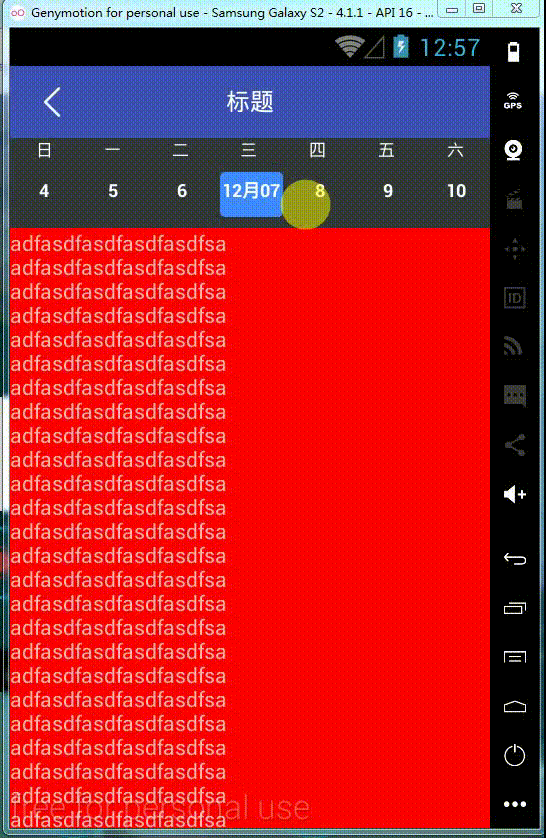

DragCanlendar---仿小米日历
----

### Usage

* include

      // project gradle
      allprojects {
          repositories {
            ...
            maven { url 'https://jitpack.io' }
          }
        }
      
      
      // your app gradle
      dependencies {
                compile 'com.github.landscapeside:DragCalendar:0.0.1'
      }

* 布局导入

		<?xml version="1.0" encoding="utf-8"?>
		<RelativeLayout xmlns:android="http://schemas.android.com/apk/res/android"
		    xmlns:tools="http://schemas.android.com/tools"
		    xmlns:app="http://schemas.android.com/apk/res-auto"
		    android:id="@+id/activity_main"
		    android:layout_width="match_parent"
		    android:layout_height="match_parent"
		    tools:context="com.landscape.dragcalendar.simple.MainActivity">
		
		    <!-- 日历的隐藏信息栏，被toolbar遮挡，通过移动toolbar显现 -->
		    
		    <com.landscape.dragcalendar.CalendarBar
		        android:id="@+id/cal_bar"
		        android:layout_width="match_parent"
		        android:layout_height="wrap_content"/>
		
		    <!-- toolbar -->
		    
		    <include
		        android:id="@+id/actionbar"
		        layout="@layout/toolbar_layout" />
		
		    <RelativeLayout
		        android:id="@+id/contentPanel"
		        android:layout_width="match_parent"
		        android:layout_height="match_parent"
		        android:layout_below="@id/actionbar">
		
		        <com.landscape.dragcalendar.DragCalendarLayout
		            android:id="@+id/drag_layout"
		            android:layout_width="match_parent"
		            android:layout_height="match_parent"
		            app:calendar_content="@+id/scroll_test">
		
		            <!-- 内容区，支持listview,scrollview,recyclerView -->
		
		            <ScrollView
		                android:id="@+id/scroll_test"
		                android:layout_width="match_parent"
		                android:layout_height="match_parent"
		                android:fillViewport="true">
		
		                <TextView
		                    android:id="@+id/tv_content"
		                    android:layout_width="match_parent"
		                    android:layout_height="match_parent"
		                    android:text="adfasdfasdfasdfasdfsa\nadfasdfasdfasdfasdfsa\nadfasdfasdfasdfasdfsa\nadfasdfasdfasdfasdfsa\nadfasdfasdfasdfasdfsa\nadfasdfasdfasdfasdfsa\nadfasdfasdfasdfasdfsa\nadfasdfasdfasdfasdfsa\nadfasdfasdfasdfasdfsa\nadfasdfasdfasdfasdfsa\nadfasdfasdfasdfasdfsa\nadfasdfasdfasdfasdfsa\nadfasdfasdfasdfasdfsa\nadfasdfasdfasdfasdfsa\nadfasdfasdfasdfasdfsa\nadfasdfasdfasdfasdfsa\nadfasdfasdfasdfasdfsa\nadfasdfasdfasdfasdfsa\nadfasdfasdfasdfasdfsa\nadfasdfasdfasdfasdfsa\nadfasdfasdfasdfasdfsa\nadfasdfasdfasdfasdfsa\nadfasdfasdfasdfasdfsa\nadfasdfasdfasdfasdfsa\nadfasdfasdfasdfasdfsa\nadfasdfasdfasdfasdfsa\nadfasdfasdfasdfasdfsa\nadfasdfasdfasdfasdfsa\nadfasdfasdfasdfasdfsa\nadfasdfasdfasdfasdfsa\nadfasdfasdfasdfasdfsa\nadfasdfasdfasdfasdfsa\nadfasdfasdfasdfasdfsa\n"
		                    android:background="@color/red"/>
		
		            </ScrollView>
		
		        </com.landscape.dragcalendar.DragCalendarLayout>
		
		    </RelativeLayout>
		
		</RelativeLayout>

* java代码中使用

	    Toolbar toolbar;
	    CalendarBar calendarBar;
	    DragCalendarLayout dragCalendarLayout;
	    CalendarPresenter presenter;
		// 初始化
	    toolbar = (Toolbar) findViewById(R.id.toolbar);
		calendarBar = (CalendarBar) findViewById(R.id.cal_bar);
        dragCalendarLayout = (DragCalendarLayout) findViewById(R.id.drag_layout);
		presenter = CalendarPresenter.instance();
		// 注册日历信息栏
        presenter.registerCalendarBar(calendarBar);
		// 日历信息栏的返回今天按钮
        calendarBar.setBackCallbk(v -> presenter.backToday());
		// 日历信息栏的收起按钮
        calendarBar.setCloseCallbk(v -> presenter.close());
		// 日历控件的选择日期的响应
        presenter.setCallbk((selectTime,isToday) -> {
            calendarBar.setDate(selectTime,isToday);
            Toast.makeText(this, selectTime, Toast.LENGTH_SHORT).show();
        });
		// 日历控件拖动的距离百分比，这里动态移动toolbar的位置
		dragCalendarLayout.setPercentListener(new DragCalendarLayout.IPercentListener() {
            @Override
            public void percentChanged(float percent) {
                int height = toolbar.getMeasuredHeight();
                toolbar.setTranslationY((int) (-height * percent));
            }
        });